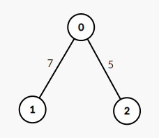
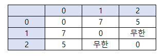
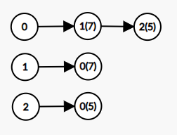

## DFS
- DFS(Depth-First Search)는 깊이 우선 탐색이라고도 부르며, 그래프에서 깊은 부분을 우선적으로 탐색하는 알고리즘이다.
- 프로그래밍에서 그래프는 크게 2가지 방식으로 표현할 수 있다.
  - **인접 행렬(Adjacency Matrix)**: 2차원 배열로 그래프의 연결 관계를 표현하는 방식
  - **인접 리스트(Adjacency List)**: 리스트로 그래프의 연결 관계를 표현하는 방식

<details>
<summary>인접 행렬 방식과 인접 리스트 방식</summary>

### 인접 행렬 방식
- 2차원 배열에 각 노드가 연결된 형태를 기록하는 방식이다.
- 연결되어 있지 않은 노드끼리는 무한의 비용이라고 작성한다.
- 정답이 될 수 없는 큰 값 중에서 999999999, 987654321 등의 값으로 초기화하는 경우가 많다.


```python
INF = 999999999 # 무한의 비용 선언
  
# 2차원 리스트를 이용해 인접 행렬 표현
graph = [
    [0, 7, 5],
    [7, 0, INF],
    [5, INF, 0]
]
  
print(graph)
```
```python
[[0, 7, 5], [7, 0, 999999999], [5, 999999999, 0]]
```
### 인접 리스트 방식
- 모든 노드에 연결된 노드에 대한 정보를 차례대로 연결하여 저장한다.
- 인접 리스트는 '연결 리스트'라는 자료구조를 이용해 구현한다.
- 별도로 연결 리스트 기능을 표준 라이브러리로 제공하는 C++이나 자바와는 달리 파이썬에서는 기본 자료형인 리스트 자료형이 append와 메소드를 제공한다. 배열과 연결 리스트의 기능을 모두 기본으로 제공하는 것이다.
- 파이썬으로 인접 리스트를 이용해 그래프를 표현하고자 할 때에도 단순히 2차원 리스트를 이용하면 된다는 점을 기억하자.


```python
# 행이 3개인 2차원 리스트로 인접 리스트 표현
graph = [[] for _ in range(3)]

# 노드 0에 연결된 노드 정보 저장(노드, 거리)
graph[0].append((1, 7))
graph[0].append((2, 5))

# 노드 1에 연결된 노드 정보 저장(노드, 거리)
graph[1].append((0, 7))

# 노드 2에 연결된 노드 정보 저장(노드, 거리)
graph[2].append((0, 5))

print(graph)
```
```python
[[(1, 7), (2, 5)], [(0, 7)], [(0, 5)]]
```

### 두 방식의 차이
- 인접 행렬 방식 - 모든 관계를 저장하므로 노드 개수가 많을수록 메모리가 불필요하게 낭비된다.
- 인접 리스트 방식 - 연결된 정보를 저장하기 때문에 메모리를 효율적으로 사용한다. (하지만 이러한 속성 때문에 특정 두 노드가 연결되어 있는지에 대한 정보를 얻는 속도가 느리다.)

</details>

## DFS 동작 과정
- DFS는 스택 자료구조를 이용하며, 구체적인 동작 과정은 다음과 같다.
1. 탐색 시작 노드를 스택에 삽입하고 방문 처리를 한다.
2. 스택 최상단 노드에 방문하지 않은 인접 노드가 있으면 그 인접 노드를 스택에 넣고 방문 처리를 한다. 방문하지 않은 인접 노드가 없으면 스택에서 최상단 노드를 꺼낸다. (DFS 기능을 생각하면 순서와 상관없이 처리해도 되지만, 번호가 낮은 순서부터 처리하도록 명시하는 경우가 종종 있으므로 관행적으로 번호가 낮은 순서부터 처리하도록 구현하는 편이다.)
3. 1, 2번의 과정을 더 이상 수행할 수 없을 때까지 반복한다.

