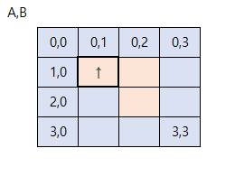

## 이론
<details>
<summary>접기/펼치기 버튼</summary>

### 구현하기 어려운 문제?
- 알고리즘은 간단한데 코드가 지나칠 만큼 길어지는 문제
- 특정 소수점 자리까지 출력해야 하는 문제
- 문자열이 입력으로 주어졌을 때 한 문자 단위로 끊어서 리스트에 넣어야 하는(파싱을 해야 하는) 문제 등
- **대체로 사소한 조건 설정이 많은 문제일수록 코드로 구현하기가 까다롭다.**

### 실제 코딩테스트에서 만나면 당황할 수 있는 구현 문제
- 프로그래밍 문법을 정확하게 숙지하지 못했거나, 라이브러리 사용 경험이 부족하면 불리하다.
- 예를 등러 파이썬으로 코테에 응시했는데 N개의 원소가 들어 있는 리스트에서 R의 원소를 뽑아 한 줄로 세우는 모든 경우(순열)을 구해야 하는 문제를 만난다면?
- 무작정 기능을 전부 작성할 수도 있다.
- 하지만 파이썬의 itertools와 같은 표준 라이브러리로 쉽게 짜는 방법도 있다.

### 구현 유형에 묶인 완전 탐색, 시뮬레이션 유형
- 완전탐색: 모든 경우의 수를 주저 없이 다 계산하는 해결 방법
- 시뮬레이션: 문제에서 제시한 알고리즘을 한 단계씩 차례대로 직접 수행해야 하는 문제 유형
- 둘 다 구현이 핵심이 되는 경우가 많다!

</details>

---

## 01_상하좌우
<details>
<summary>접기/펼치기 버튼</summary>

### 문제


</details>

---

## 02_시각
<details>
<summary>접기/펼치기 버튼</summary>

### 문제
정수 N이 입력되면 00시 00분 00초부터 N시 59분 59초까지의 모든 시각 중에서 3이 하나라도 포함되는 모든 경우의 수를 구하는 프로그램을 작성하시오. 예를 들어 1을 입력했을 때 다음은 3이 하나라도 포함되어 있으므로 세어야 하는 시각이다.
- 00시 00분 03초
- 00시 13분 30초

반면에 다음은 3이 하나도 포함되어 있지 않으므로 세면 안 되는 시각이다.
- 00시 02분 55초
- 01시 27분 45초

### 답안 예시
```python
h = int(input())

import time
start_time = time.time() # 측정 시작

count = 0
for i in range(h+1):
    for j in range(60):
        for k in range(60):
            # 매 시각 안에 '3'이 포함되어 있다면 카운트 증가
            if '3' in str(i) + str(j) + str(k):
                count += 1

end_time = time.time()  # 측정 종료
print("time :", end_time - start_time)  # 수행 시간 출력

print(count)
```

### 문제 풀이 팁
이 문제는 모든 시각의 경우를 하나씩 모두 세서 쉽게 풀 수 있는 문제다.
하루는 00시 00분 00초부터 23시 59분 59초까지로 모든 경우는 86400가지밖에 존재하지 않기 때문이다.
즉 경우의 수가 100,000개도 되지 않으므로 파이썬 문자열 연산을 이용해 3이 시각에 포함되어 있는지 확인해도 시간 제한 2초 안에 문제를 해결할 수 있다.<br>
이러한 유형은 **완전 탐색** 유형으로 분류되기도 한다. 완전 탐색 문제 또한 구현이 중요한 대표적인 문제 유형인데, 일반적으로 완전 탐색 알고리즘은 비효율적인 시간 복잡도를 가지고 있으므로 데이터 개수가 큰 경우에 정상적으로 동작하지 않을 수 있다.<br>
그래서 일반적으로 알고리즘 문제를 풀 때는 확인(탐색)해야 할 전체 데이터의 개수가 **100만 개 이하일 때** 완전 탐색을 사용하면 적절하다.
</details>

---

## 03_왕실의나이트
<details>
<summary>접기/펼치기 버튼</summary>

### 문제


나이트는 수평으로 두 칸 이동 후 수직으로 한 칸 이동하거나 수직으로 두 칸 이동 후 수평으로 한 칸 이동하는 것이 가능하다.<br>
8x8 좌표 평면상에서 나이트의 위치가 주어졌을 때 나이트가 이동할 수 있는 경우의 수를 출력하는 프로그램을 작성하시오.<br>
이때 행의 위치를 표현할 때는 1부터 8로 표현하고, 열 위치를 표현할 때에는 a부터 h로 표현한다.

### 문제 풀이 팁
'01_상하좌우' 문제에서는 dx, dy 리스트를 선언해 이동할 방향을 기록할 수 있도록 하였다.<br>
이 문제에서는 steps 변수가 dx와 dy 변수의 기능을 대신하여 수행한다. 2가지 형태 모두 자주 사용되므로 참고하자.

</details>

---

## 04_게임개발
<details>
<summary>접기/펼치기 버튼</summary>

### 문제
캐릭터가 있는 장소는 1x1 크기의 정사각형으로 이루어진 NxM 크기의 직사각형으로, 각각의 칸은 육지 또는 바다이다. 캐릭터는 동서남북 중 한 곳을 바라본다.<br>
맵의 각 칸은 (A, B)로 나타낼 수 있고, A는 북쪽으로부터 떨어진 칸의 개수, B는 서쪽으로부터 떨어진 칸의 개수이다. 캐릭터는 상하좌우로 움직일 수 있고, 바다로 되어 있는 공간에는 갈 수 없다. 캐릭터의 움직임을 설정하기 위해 정해 놓은 매뉴얼을 이러하다.<br>
1. 현재 위치에서 현재 방향을 기준으로 왼쪽 방향(반시계 방향으로 90도 회전한 방향)부터 차례대로 갈 곳을 정한다.
2. 캐릭터의 바로 왼쪽 방향에 가보지 않은 칸이 존재한다면, 왼쪽 방향으로 회전한 다음 왼쪽으로 한 칸을 전진한다. 왼쪽 방향에 가보지 않은 칸이 없다면, 왼쪽 방향으로 회전만하고 1단계로 돌아간다.
3. 만약 네 방향 모두 이미 가본 칸이거나 바다로 되어 있는 칸인 경우에는, 바라보는 방향을 유지한 채로 한칸 뒤로 가고 1단계로 돌아간다. 단, 이때 뒤쪽 방향이 바다인 칸이라 뒤로 갈 수 없는 경우에는 움직임을 멈춘다.

위 과정을 반복적으로 수행하면서 캐릭터의 움직임에 이상이 있는지 테스트하려고 한다. 메뉴얼에 따라 캐릭터를 이동시킨 뒤에, 캐릭터가 방문한 칸의 수를 출력하는 프로그램을 만드시오.

### 입력 조건
- 첫째 줄에 세로 크기 N과 가로 크기 M을 공백으로 구분해 입력한다. (3<=N, M<=50)
- 둘째 줄에 게임 캐릭터가 있는 칸의 좌표(A, B)와 바라보는 방향 d가 각각 서로 공백으로 구분하여 주어진다. 방향 d의 값으로는 다음과 같이 4가지가 존재한다.
  - 0: 북쪽
  - 1: 동쪽
  - 2: 남쪽
  - 3: 서쪽
- 셋째 줄부터 맵이 육지인지 바다인지에 대한 정보가 주어진다. N개의 줄에 맵의 상태가 북쪽부터 남쪽 순서대로, 각 줄의 데이터는 서쪽부터 동쪽 순서대로 주어진다. 맵의 외곽은 항상 바다로 되어 있다.
  - 0: 육지
  - 1: 바다
- 처음에 게임 캐릭터가 위치한 칸의 상태는 항상 육지이다.

### 출력 조건
- 첫째 줄에 이동을 마친 후 캐릭터가 방문한 칸의 수를 출력한다.

### 입력 예시

```python
4 4
1 1 0
1 1 1 1
1 0 0 1
1 1 0 1
1 1 1 1
```

### 출력 예시
3

### 문제 풀이 팁

</details>

