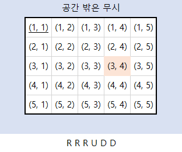

## 이론
<details>
<summary>접기/펼치기 버튼</summary>

### 구현하기 어려운 문제?
- 알고리즘은 간단한데 코드가 지나칠 만큼 길어지는 문제
- 특정 소수점 자리까지 출력해야 하는 문제
- 문자열이 입력으로 주어졌을 때 한 문자 단위로 끊어서 리스트에 넣어야 하는(파싱을 해야 하는) 문제 등
- **대체로 사소한 조건 설정이 많은 문제일수록 코드로 구현하기가 까다롭다.**

### 실제 코딩테스트에서 만나면 당황할 수 있는 구현 문제
- 프로그래밍 문법을 정확하게 숙지하지 못했거나, 라이브러리 사용 경험이 부족하면 불리하다.
- 예를 등러 파이썬으로 코테에 응시했는데 N개의 원소가 들어 있는 리스트에서 R의 원소를 뽑아 한 줄로 세우는 모든 경우(순열)을 구해야 하는 문제를 만난다면?
- 무작정 기능을 전부 작성할 수도 있다.
- 하지만 파이썬의 itertools와 같은 표준 라이브러리로 쉽게 짜는 방법도 있다.

### 구현 유형에 묶인 완전 탐색, 시뮬레이션 유형
- 완전탐색: 모든 경우의 수를 주저 없이 다 계산하는 해결 방법
- 시뮬레이션: 문제에서 제시한 알고리즘을 한 단계씩 차례대로 직접 수행해야 하는 문제 유형
- 둘 다 구현이 핵심이 되는 경우가 많다!

</details>

---

## 01_상하좌우


---

## 02_시각
### 문제
정수 N이 입력되면 00시 00분 00초부터 N시 59분 59초까지의 모든 시각 중에서 3이 하나라도 포함되는 모든 경우의 수를 구하는 프로그램을 작성하시오. 예를 들어 1을 입력했을 때 다음은 3이 하나라도 포함되어 있으므로 세어야 하는 시각이다.
- 00시 00분 03초
- 00시 13분 30초

반면에 다음은 3이 하나도 포함되어 있지 않으므로 세면 안 되는 시각이다.
- 00시 02분 55초
- 01시 27분 45초

### 답안 예시
```python
h = int(input())

import time
start_time = time.time() # 측정 시작

count = 0
for i in range(h+1):
    for j in range(60):
        for k in range(60):
            # 매 시각 안에 '3'이 포함되어 있다면 카운트 증가
            if '3' in str(i) + str(j) + str(k):
                count += 1

end_time = time.time()  # 측정 종료
print("time :", end_time - start_time)  # 수행 시간 출력

print(count)
```

### 문제 풀이 팁
이 문제는 모든 시각의 경우를 하나씩 모두 세서 쉽게 풀 수 있는 문제다.
하루는 00시 00분 00초부터 23시 59분 59초까지로 모든 경우는 86400가지밖에 존재하지 않기 때문이다.
즉 경우의 수가 100,000개도 되지 않으므로 파이썬 문자열 연산을 이용해 3이 시각에 포함되어 있는지 확인해도 시간 제한 2초 안에 문제를 해결할 수 있다.<br>
이러한 유형은 **완전 탐색** 유형으로 분류되기도 한다. 완전 탐색 문제 또한 구현이 중요한 대표적인 문제 유형인데, 일반적으로 완전 탐색 알고리즘은 비효율적인 시간 복잡도를 가지고 있으므로 데이터 개수가 큰 경우에 정상적으로 동작하지 않을 수 있다.<br>
그래서 일반적으로 알고리즘 문제를 풀 때는 확인(탐색)해야 할 전체 데이터의 개수가 **100만 개 이하일 때** 완전 탐색을 사용하면 적절하다.